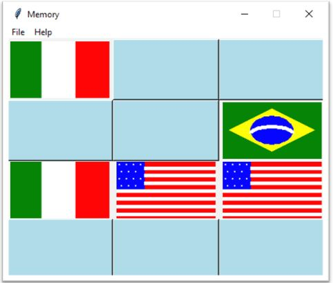

# Memory
The objective of the game is to turn over pair of matching cards. If you open 2 cards that doesn't match, both cards will be closed and you should try again.
The gol of the game is to open all cards in fewer attemps

## Installation
pip install tkinter

## Future Implementaion
- create more cards
- add score 
- add more features to the main menu
  - restart the game
  - level of difficult
